# Engineer App Architecture Audit

Generated on: 2026-07-02

## 0 Metadata

| Field | Value |
|---|---|
| Product name | Engineer App |
| Repository | `chumley_navigator` |
| Branch | `main` |
| Commit | `39cefafbe189c6615ea859a478d29a589b3b6ecc` |
| Audit date | 2026-07-02 |
| Cloud identifiers | `API_BASE_URL=https://navigator.chumley.ai`, `AZURE_TENANT_ID=93ce9c27-3bb2-4ef2-b686-1829de4f2584`, `AZURE_CLIENT_ID=d6576bc2-a5e1-4666-99a2-2a6cdce10a85`, `AZURE_REDIRECT_URI=msauth.uk.co.aspect.engineerapp://auth`, `TOMTOM_API_KEY` build-time env, Android `applicationId=com.example.chumley_navigator`, iOS/macOS bundle IDs still `com.example.chumleyNavigator` |
| Repository coverage | Flutter client, route composition, local caches, auth flow, feature screens, platform shells, and UI components |
| Audit limitations | No backend repository in this workspace, no Firestore or Salesforce client SDKs, no CI/CD workflows, no Dockerfiles, no Firebase configs, and no AI client code were found |

Evidence: [lib/core/app_constants.dart](/Users/gaurav/Documents/Work/aspect/chumley_navigator/lib/core/app_constants.dart#L2), [lib/main.dart](/Users/gaurav/Documents/Work/aspect/chumley_navigator/lib/main.dart#L11), [android/app/build.gradle.kts](/Users/gaurav/Documents/Work/aspect/chumley_navigator/android/app/build.gradle.kts#L9), [ios/Runner.xcodeproj/project.pbxproj](/Users/gaurav/Documents/Work/aspect/chumley_navigator/ios/Runner.xcodeproj/project.pbxproj#L372)

## 0a External Repository Sweep

| Repository / Service | Purpose | Reachability | Boundary Decision | Authentication | Data Direction | Deployment |
|---|---|---|---|---|---|---|
| Navigator Backend | Auth exchange, signout, profile, points, leaderboard, absences, VCR, milestones, fixed-price catalogs | Directly reachable through `ApiEndpoints.baseUrl` and the documented API paths | Boundary Node | Bearer session token after mobile exchange | App -> backend on every feature fetch and submit | Remote service at `https://navigator.chumley.ai` by default |
| Microsoft Entra ID via `aad_oauth` | OAuth login and token acquisition | Directly reachable from `AzureAuthService` | Boundary Node | PKCE-based OAuth; no client secret in app | App -> Microsoft, Microsoft -> app | Microsoft cloud |
| TomTom Maps API | Job detail tile layer | Directly reachable in `JobDetailPage` | Boundary Node | API key query parameter from `AppConstants.tomtomApiKey` | App -> TomTom | Public SaaS |
| Microsoft Graph | Canonical email lookup in backend auth docs | Referenced only in local auth guides | Boundary Node | Backend-only in docs | Backend -> Graph | Microsoft cloud |
| Salesforce | Engineer identity and business data in backend docs | Referenced only in local auth guides | Boundary Node | Backend-only in docs | Backend -> Salesforce | Salesforce cloud |
| Firestore | Session token persistence mentioned in auth docs | Referenced only in local auth guides | Boundary Node | Backend-only in docs | Backend -> Firestore | Google Cloud / Firebase |
| Google Maps / Apple Maps / Waze / Citymapper / OsmAnd / 2GIS | External navigation launch targets | Reachable through URL schemes and web URLs | Boundary Node | None from app | App -> external app | User device / external app |

Evidence: [lib/service/auth_service.dart](/Users/gaurav/Documents/Work/aspect/chumley_navigator/lib/service/auth_service.dart#L21), [lib/core/network/api_endpoints.dart](/Users/gaurav/Documents/Work/aspect/chumley_navigator/lib/core/network/api_endpoints.dart#L5), [lib/screens/job_details/job_detail_page.dart](/Users/gaurav/Documents/Work/aspect/chumley_navigator/lib/screens/job_details/job_detail_page.dart#L885), [MOBILE_APP_AUTH_GUIDE_V2.md](/Users/gaurav/Documents/Work/aspect/chumley_navigator/MOBILE_APP_AUTH_GUIDE_V2.md#L119)

## Discovery

### Package Inventory

#### Flutter / Dart packages

- `flutter_screenutil`
- `confetti`
- `video_player`
- `lucide_icons_flutter`
- `flutter_lucide`
- `dropdown_button2`
- `image_picker`
- `google_fonts`
- `shared_preferences`
- `flutter_secure_storage`
- `dio`
- `aad_oauth`
- `flutter_bloc`
- `equatable`
- `geolocator`
- `map_launcher`
- `action_slider`
- `permission_handler`
- `geocoding`
- `url_launcher`
- `flutter_map`
- `latlong2`
- `flutter_image_compress`
- `path_provider`

Evidence: [pubspec.yaml](/Users/gaurav/Documents/Work/aspect/chumley_navigator/pubspec.yaml#L38)

#### Native Android dependencies

- Android app plugin and Kotlin plugin
- Java 17 source/target compatibility
- Internet, camera, fine location, and coarse location permissions
- Debug signing used for `release`

Evidence: [android/app/build.gradle.kts](/Users/gaurav/Documents/Work/aspect/chumley_navigator/android/app/build.gradle.kts#L9), [android/app/src/main/AndroidManifest.xml](/Users/gaurav/Documents/Work/aspect/chumley_navigator/android/app/src/main/AndroidManifest.xml#L2)

#### Native iOS / macOS dependencies

- CocoaPods integration
- iOS camera, photo library, and location usage strings
- iOS URL scheme queries for map apps
- macOS app shell with default bundle identifiers

Evidence: [ios/Runner/Info.plist](/Users/gaurav/Documents/Work/aspect/chumley_navigator/ios/Runner/Info.plist#L48), [ios/Runner.xcodeproj/project.pbxproj](/Users/gaurav/Documents/Work/aspect/chumley_navigator/ios/Runner.xcodeproj/project.pbxproj#L372), [macos/Runner/Configs/AppInfo.xcconfig](/Users/gaurav/Documents/Work/aspect/chumley_navigator/macos/Runner/Configs/AppInfo.xcconfig#L11)

#### Build tools

- Flutter toolchain
- Dart SDK `^3.10.3`
- Android Gradle / Kotlin Gradle
- CocoaPods
- Xcode project scaffolding
- CMake for desktop shells

Evidence: [pubspec.yaml](/Users/gaurav/Documents/Work/aspect/chumley_navigator/pubspec.yaml#L11), [android/settings.gradle.kts](/Users/gaurav/Documents/Work/aspect/chumley_navigator/android/settings.gradle.kts#L1), [ios/Podfile](/Users/gaurav/Documents/Work/aspect/chumley_navigator/ios/Podfile#L1)

#### CI/CD / Docker / Deployment workflows

- No GitHub Actions workflow found
- No Dockerfile found
- No Firebase Hosting config found
- No Cloud Build config found
- No deployment workflow files found

Evidence: repository sweep

## 1 What This System Does

The Engineer App is the mobile client surface for field engineers inside the Navigator platform. It is not a standalone system. The app authenticates against Microsoft Entra ID, exchanges the Microsoft tokens with the Navigator Backend, then uses the returned session token to call backend APIs for profile data, points, leaderboard rankings, absences, vehicle allocations, VCR submission, milestones, and fixed-price work-order catalogs.

The app owns presentation, navigation, local caching, and session persistence. It does not directly implement Salesforce, Firestore, or AI logic in this repository. Those are backend boundary nodes documented in the auth guides but not implemented here.

### Purpose

- Provide field engineers with a mobile dashboard
- Support vehicle condition reporting
- Support absences and enquiry submission
- Show reward, KPI, leaderboard, milestone, and profile information

### Users

- Field engineers

### Responsibilities

- Microsoft sign-in
- Session token storage
- Bearer-authenticated API calls
- Offline fallback from local caches
- Feature navigation
- Local UI validation

### Data ownership

- Owned locally: theme flag, session token, auth user snapshot, cached API payloads, in-memory example-photo caches, geocoding cache
- Not owned locally: Salesforce source records, backend session authority, backend profile truth, backend caches

### Relationship to Navigator Backend

The app talks to Navigator Backend through a single Dio client with a bearer token interceptor. The backend owns the authoritative response for all feature data. The mobile app only caches successful responses and falls back to those caches on failure.

### Relationship to Salesforce

The app does not call Salesforce directly. The local auth docs state that the backend validates engineer identity through Salesforce `ServiceResource` and `FSM__c` logic.

### Relationship to Firestore

The app does not use Firestore client SDKs. Firestore is only mentioned in the auth guide as a possible backend session store, which is not implemented in this repo.

### Relationship to AI services

No AI client code is present. No OpenAI, Gemini, or similar SDKs were found. Any AI usage would be backend-only and is unverified here.

Evidence: [lib/main.dart](/Users/gaurav/Documents/Work/aspect/chumley_navigator/lib/main.dart#L11), [lib/core/app_dependencies.dart](/Users/gaurav/Documents/Work/aspect/chumley_navigator/lib/core/app_dependencies.dart#L34), [lib/core/network/dio_interceptors.dart](/Users/gaurav/Documents/Work/aspect/chumley_navigator/lib/core/network/dio_interceptors.dart#L18), [MOBILE_APP_AUTH_GUIDE_V2.md](/Users/gaurav/Documents/Work/aspect/chumley_navigator/MOBILE_APP_AUTH_GUIDE_V2.md#L119)

## 2 Feature Inventory

### Application layer

| Feature | Purpose | Flutter Screen |
|:--------|:--------|:---------------|
| Splash | Boot animation and auth gate | `SplashScreen` |
| Login | Microsoft sign-in and token exchange | `LoginScreen` |
| Home shell | Bottom-tab navigation for core engineer surfaces | `Home` |
| Dashboard | Core KPI and scheduling landing page | `DashboardScreen` |
| Leaderboard | Engineer ranking view | `LeaderboardScreen` |
| Milestones | Milestone progress and celebration flow | `MilestoneScreen` |
| Vehicle Check | Select allocated vehicle and inspect it | `VehileCheckScreen` |
| Vehicle Form | Capture and submit VCR photos | `VehicleForm` |
| Absences | List and submit absences | `AbsencesScreen` |
| Enquiries | Submit enquiry form | `EnquiriesScreen` |
| Forms | Work-type selection and inspection forms | `FormsScreen`, `InspectionReportPage` |
| Profile | Profile details and sign-out | `ProfileScreen` |
| Rewards | Points redemption and reward journey | `RedeemPointsScreen` |
| Goals | KPI drill-down page | `GoalsTargetsScreen` |
| Notifications | Static notification inbox shell | `NotificationScreen` |
| Earnings detail | Placeholder earnings page | `EarningsDetailScreen` |
| Job detail | Appointment detail, maps, raise-job flow, and form completion | `JobDetailPage` |
| Fixed price | Stepwise estimate creation | `FixedPricePage` |

### Backend integration

| Feature | Navigator Backend Endpoint(s) | Backend Module | Microservice |
|:--------|:------------------------------|:---------------|:-------------|
| Splash | none | `LoginCubit.checkAuthStatus()` boundary only | `Navigator Backend` boundary node for later screens |
| Login | `POST /api/auth/mobile/exchange`<br>`POST /api/auth/signout` | `backend/blueprints/auth.py` and `backend/mobile_auth.py` are referenced in docs only | Auth boundary node |
| Home shell | indirect through child tabs | route composition only | `Navigator Backend` boundary node |
| Dashboard | `GET /api/engineer/{id}`<br>`GET /api/engineers/{id}/points/summary` | `dashboard` boundary module | `Navigator Backend` boundary node |
| Leaderboard | `GET /api/leaderboard` | `leaderboard` boundary module | `Navigator Backend` boundary node |
| Milestones | `GET /api/engineers/{id}/milestones` | `milestones` boundary module | `Navigator Backend` boundary node |
| Vehicle Check | `GET /api/vcr/allocations` | `vehicle-check` boundary module | `Navigator Backend` boundary node |
| Vehicle Form | `GET /api/vcr/examples/{section}`<br>`POST /api/vcr/submit` | `vehicle-check` boundary module | `Navigator Backend` boundary node |
| Absences | `GET /api/engineer/absences`<br>`POST /api/engineer/absences` | `absences` boundary module | `Navigator Backend` boundary node |
| Enquiries | none found | none found | none found |
| Forms | none found | none found | none found |
| Profile | `POST /api/auth/signout` plus profile fetch via dashboard cubit | `dashboard` boundary module for profile data | `Navigator Backend` boundary node |
| Rewards | none found | none found | none found |
| Goals | none found | none found | none found |
| Notifications | none found | none found | none found |
| Earnings detail | none found | none found | none found |
| Job detail | none directly; opens fixed-price screen and forms locally | backend mapping unverified | `Navigator Backend` boundary node for appointment data |
| Fixed price | `GET /api/work-orders/catalog/trades`<br>`GET /api/work-orders/catalog/categories`<br>`GET /api/work-orders/catalog/work-types` | `work-orders/catalog` boundary module | `Navigator Backend` boundary node |

### Auth, caching, and external systems

| Feature | Authentication | Real-time / Cached | Salesforce Objects | Firestore Collections | AI Used | Business Owner |
|:--------|:---------------|:-------------------|:-------------------|:----------------------|:--------|:---------------|
| Splash | Reads app session state only | No cache; routes based on local auth snapshot | none directly | none directly | none found | ⚠️ UNVERIFIED |
| Login | Microsoft OAuth + local session bearer | Not cached; stores result in secure storage | `ServiceResource` and `FSM__c` in docs only | `session tokens` mentioned in docs only | none found | ⚠️ UNVERIFIED |
| Home shell | Requires authenticated session for hosted tabs | Uses child-screen caches | none directly | none directly | none found | ⚠️ UNVERIFIED |
| Dashboard | Bearer session token | Cached profile and points in `SharedPreferences` | none directly | none directly | none found | ⚠️ UNVERIFIED |
| Leaderboard | Bearer session token | Cached leaderboard in `SharedPreferences` | none directly | none directly | none found | ⚠️ UNVERIFIED |
| Milestones | Bearer session token | Cached milestones in `SharedPreferences` | none directly | none directly | none found | ⚠️ UNVERIFIED |
| Vehicle Check | Bearer session token | Cached vehicle allocations in `SharedPreferences` | none directly | none directly | none found | ⚠️ UNVERIFIED |
| Vehicle Form | Bearer session token | Example photos cached in-memory only | none directly | none directly | none found | ⚠️ UNVERIFIED |
| Absences | Bearer session token | Cached absences in `SharedPreferences` | none directly | none directly | none found | ⚠️ UNVERIFIED |
| Enquiries | None visible | No persistence found | none directly | none directly | none found | ⚠️ UNVERIFIED |
| Forms | None visible | No persistence found | none directly | none directly | none found | ⚠️ UNVERIFIED |
| Profile | Bearer session token | Falls back to cached profile in `SharedPreferences` | none directly | none directly | none found | ⚠️ UNVERIFIED |
| Rewards | Bearer session token if opened from dashboard | Uses points state passed via route arguments and bottom sheet | none directly | none directly | none found | ⚠️ UNVERIFIED |
| Goals | Route argument only | No persistence found | none directly | none directly | none found | ⚠️ UNVERIFIED |
| Notifications | Route access only | No persistence found | none directly | none directly | none found | ⚠️ UNVERIFIED |
| Earnings detail | Route access only | No persistence found | none directly | none directly | none found | ⚠️ UNVERIFIED |
| Job detail | Requires upstream appointment object | Local map/geocode cache in-memory | none directly | none directly | none found | ⚠️ UNVERIFIED |
| Fixed price | Bearer session token | Trades cached in `SharedPreferences`; categories/work types not cached | none directly | none directly | none found | ⚠️ UNVERIFIED |

Evidence: [lib/utils/routes.dart](/Users/gaurav/Documents/Work/aspect/chumley_navigator/lib/utils/routes.dart#L16), [lib/screens/dashboard/service/dashboard_api_service.dart](/Users/gaurav/Documents/Work/aspect/chumley_navigator/lib/screens/dashboard/service/dashboard_api_service.dart#L16), [lib/screens/vehicle_check/service/vehicle_check_api_service.dart](/Users/gaurav/Documents/Work/aspect/chumley_navigator/lib/screens/vehicle_check/service/vehicle_check_api_service.dart#L16), [lib/screens/job_details/service/fixed_price_api_service.dart](/Users/gaurav/Documents/Work/aspect/chumley_navigator/lib/screens/job_details/service/fixed_price_api_service.dart#L13)

### Hidden / Internal Destinations

- `InspectionReportPage` is opened directly with `MaterialPageRoute` from `FormsScreen` and `JobDetailPage`
- `DashboardBottomSheet` is opened as a modal from the dashboard calendar
- `RedeemPointsBottomModal` is opened from the points card and redeem screen
- Cupertino time picker sheet is used in absences
- `AlertDialog` and `CupertinoActionSheet` flows exist in job detail and fixed-price screens
- `EarningsDetailScreen` is in the route map but has no in-tree navigation trigger found

Evidence: [lib/screens/forms/forms_screen.dart](/Users/gaurav/Documents/Work/aspect/chumley_navigator/lib/screens/forms/forms_screen.dart#L56), [lib/components/dashboard/dashboard_calendar.dart](/Users/gaurav/Documents/Work/aspect/chumley_navigator/lib/components/dashboard/dashboard_calendar.dart#L124), [lib/components/dashboard/points_card.dart](/Users/gaurav/Documents/Work/aspect/chumley_navigator/lib/components/dashboard/points_card.dart#L124), [lib/screens/job_details/job_detail_page.dart](/Users/gaurav/Documents/Work/aspect/chumley_navigator/lib/screens/job_details/job_detail_page.dart#L1611)

## 3 Component Inventory

| Component | Purpose | Entry Point | Major Files | Dependencies | Configuration | Deployment | Runtime | Shared Infrastructure | Connections |
|---|---|---|---|---|---|---|---|---|---|
| App bootstrap | App composition root | `main()` | `lib/main.dart`, `lib/core/app_dependencies.dart` | ScreenUtil, ThemeScope, BlocProvider, MaterialApp | `--dart-define` values via `AppConstants` | Flutter app shell | App startup | Navigator key shared across auth logout redirects | All routes |
| Theme system | Persisted dark/light mode | `ThemeNotifier` | `lib/providers/theme_notifier.dart`, `lib/widgets/theme_scope.dart`, `lib/utils/dashboard_theme.dart` | SharedPreferences | `isDark` key | Client-only | Global rebuilds on theme change | Shared UI shell | Almost every screen |
| Auth container | Microsoft login and session exchange | `AzureAuthService`, `LoginRepository`, `LoginCubit` | `lib/service/auth_service.dart`, `lib/screens/login/*` | aad_oauth, Dio, secure storage, SharedPreferences | tenant/client/redirect env vars | Client-only | Login and logout | Shared bearer token | Splash, login, profile, backend API |
| API client | HTTP wrapper and bearer interceptor | `ApiClient` | `lib/core/network/*` | Dio, Prefs | `API_BASE_URL` | Client-only | Network calls | Shared auth header logic | All backend-facing services |
| Dashboard feature stack | KPI dashboard and scheduling | `DashboardScreen` | `lib/screens/dashboard/*`, `lib/components/dashboard/*` | BLoC, cached profile, cached points, calendar components | none beyond route args | Client-only | Stateful dashboard rendering | Shared navigator and caches | Profile, notifications, goals, redeem points, job detail |
| Leaderboard feature stack | Ranking and podium UI | `LeaderboardScreen` | `lib/screens/leaderboard/*`, `lib/shimmers/leaderboard_shimmer.dart` | BLoC, cached leaderboard | none | Client-only | Cached loading and refresh | Shared local cache | Navigator backend leaderboard endpoint |
| Milestones feature stack | Badge progression and confetti | `MilestoneScreen` | `lib/screens/milestones/*`, `lib/data/milestone_definitions.dart`, `lib/widgets/milestones/*` | BLoC, confetti | none | Client-only | Interactive milestone cards | Shared local cache | Navigator backend milestones endpoint |
| Vehicle check feature stack | VCR allocation and form submission | `VehileCheckScreen`, `VehicleForm` | `lib/screens/vehicle_check/*`, `lib/widgets/vehicle/*` | BLoC, image_picker, flutter_image_compress, file system | `AppConstants.isProduction` changes image source chooser | Client-only | Multi-step capture and multipart submit | Shared local cache and photo compression | Navigator backend VCR endpoints |
| Absences feature stack | Absence form and list | `AbsencesScreen` | `lib/screens/absences/*`, `lib/widgets/absences/*` | BLoC, dropdown_button2 | none | Client-only | Local validation and submit | Shared local cache | Navigator backend absences endpoints |
| Job detail feature stack | Appointment detail and map/navigation | `JobDetailPage` | `lib/screens/job_details/job_detail_page.dart` | geolocator, geocoding, flutter_map, url_launcher | `AppConstants.tomtomApiKey` | Client-only | Map rendering, actions, dialogs, action slider | In-memory geocode cache | TomTom, Google Maps, Apple Maps |
| Fixed-price feature stack | Catalog-driven estimate builder | `FixedPricePage` | `lib/screens/job_details/fixed_price_page.dart`, `lib/screens/job_details/*` | BLoC, dropdown_button2 | none | Client-only | Multi-step form with cached catalog | Shared local cache | Navigator backend work-order catalog endpoints |

Evidence: [lib/core/app_dependencies.dart](/Users/gaurav/Documents/Work/aspect/chumley_navigator/lib/core/app_dependencies.dart#L34), [lib/providers/theme_notifier.dart](/Users/gaurav/Documents/Work/aspect/chumley_navigator/lib/providers/theme_notifier.dart#L5), [lib/screens/dashboard/dashboard_screen.dart](/Users/gaurav/Documents/Work/aspect/chumley_navigator/lib/screens/dashboard/dashboard_screen.dart#L23), [lib/screens/job_details/job_detail_page.dart](/Users/gaurav/Documents/Work/aspect/chumley_navigator/lib/screens/job_details/job_detail_page.dart#L44)

## 4 Data Layer

### Local persistence

| Store | Owner | Reader | Writer | Purpose | TTL | Caching | Synchronization |
|---|---|---|---|---|---|---|---|
| `flutter_secure_storage` session key `aspect_session` | App | `DioInterceptor`, `LoginRepository`, `Prefs.getSessionToken()` | `SessionStorage`, `Prefs.saveSessionToken()` | Persist backend bearer session token securely | Not defined | Secure persistent cache | Cleared on logout and 401 |
| SharedPreferences key `authUser` | App | dashboard/profile/milestones/vehicle/absences | `Prefs.saveAuthUser()` | Persist auth metadata from mobile exchange | Not defined | Persistent cache | Updated on login, cleared on logout |
| SharedPreferences key `user` | App | dashboard/profile | `Prefs.saveUser()` | Cache full dashboard profile | Not defined | Persistent cache | Updated after profile fetch |
| SharedPreferences key `leaderboard` | App | leaderboard | `Prefs.saveLeaderboardCache()` | Cache leaderboard response | Not defined | Persistent cache | Updated after leaderboard fetch |
| SharedPreferences key `performanceHistory` | App | dashboard/redeem points | `Prefs.savePoints()` | Cache points history | Not defined | Persistent cache | Updated after points fetch |
| SharedPreferences key `vehicleAllocations` | App | vehicle check | `Prefs.saveVehicleAllocations()` | Cache vehicle allocations | Not defined | Persistent cache | Updated after allocation fetch |
| SharedPreferences key `absences` | App | absences | `Prefs.saveAbsences()` | Cache absence list | Not defined | Persistent cache | Updated after absence fetch |
| SharedPreferences key `milestones_cache` | App | milestones | `Prefs.saveMilestonesCache()` | Cache milestones | Not defined | Persistent cache | Updated after milestone fetch |
| SharedPreferences key `fixed_price_trades_cache` | App | fixed-price page | `Prefs.saveFixedPriceTrades()` | Cache trade catalog | Not defined | Persistent cache | Updated after trade fetch |
| SharedPreferences key `isDark` | App | theme layer | `ThemeNotifier.setDark()` | Persist theme preference | Not defined | Persistent preference | Updated on toggle |

### In-memory caches

- `VcrExamplesCubit` caches example-photo responses per section and per step in memory
- `GeocodingService` caches geocoded addresses in a static `Map<String, LatLng>`
- `MilestoneBadge` keeps runtime-only override maps for unlocked state, current value, and progress

### Stores not found

- Hive: not found
- SQLite / sqflite: not found
- Firebase Storage client: not found
- Firestore client: not found
- Salesforce client: not found
- Temporary file cache beyond platform temp dirs: used only for image compression, not as app data storage

Evidence: [lib/core/storage/prefs.dart](/Users/gaurav/Documents/Work/aspect/chumley_navigator/lib/core/storage/prefs.dart#L58), [lib/core/storage/session_storage.dart](/Users/gaurav/Documents/Work/aspect/chumley_navigator/lib/core/storage/session_storage.dart#L1), [lib/providers/theme_notifier.dart](/Users/gaurav/Documents/Work/aspect/chumley_navigator/lib/providers/theme_notifier.dart#L5), [lib/screens/vehicle_check/cubit/vcr_examples_cubit.dart](/Users/gaurav/Documents/Work/aspect/chumley_navigator/lib/screens/vehicle_check/cubit/vcr_examples_cubit.dart#L1)

## 5 AI Usage

No AI feature was verified in the Engineer App client.

- No AI SDKs found in `pubspec.yaml`
- No prompt files found in `lib/`
- No endpoint names in `ApiEndpoints` that suggest AI inference
- No OpenAI, Gemini, Azure OpenAI, or local LLM client code found

The Navigator AI boundary exists only as a concept in the user request and auth guides; implementation is unverified in this repository.

Evidence: [pubspec.yaml](/Users/gaurav/Documents/Work/aspect/chumley_navigator/pubspec.yaml#L38), [lib/core/network/api_endpoints.dart](/Users/gaurav/Documents/Work/aspect/chumley_navigator/lib/core/network/api_endpoints.dart#L5)

## 6 External Integrations

| Integration | Evidence | What it does | Notes |
|---|---|---|---|
| Microsoft Entra ID | `aad_oauth` in `pubspec.yaml`, `AzureAuthService` | OAuth login, token retrieval, logout | App uses client ID, tenant ID, and custom redirect URI from `AppConstants` |
| Navigator Backend | `ApiEndpoints`, `ApiClient`, `DioInterceptor` | Auth exchange, signout, profile, points, leaderboard, VCR, absences, milestones, fixed-price catalogs | Base URL defaults to `https://navigator.chumley.ai` |
| TomTom Maps | `JobDetailPage` map tile URL | Map tiles for appointment detail | API key is passed in URL from `AppConstants.tomtomApiKey` |
| Google Maps | `MapNavigationService` and iOS URL schemes | External navigation | Opened via URL launcher |
| Apple Maps | `MapNavigationService` | External navigation on iOS | Opened via URL launcher |
| Geolocator / Geocoding | `JobDetailPage` | Position and address lookup | Client-side location support |
| Image capture / compression | `image_picker`, `flutter_image_compress` | Vehicle inspection photo capture | Photos are compressed before upload |
| SharedPreferences | `Prefs`, `ThemeNotifier` | Local persistence | Non-secret cache and preference store |
| Secure storage | `SessionStorage` | Persist backend bearer token | Encrypted on Android via `encryptedSharedPreferences` |

### Not present

- Salesforce client SDK: not present
- Firestore client SDK: not present
- Firebase Crashlytics / Analytics / Messaging: not present
- Cloud Run client integration: not present
- Navigator AI client integration: not present

Evidence: [pubspec.yaml](/Users/gaurav/Documents/Work/aspect/chumley_navigator/pubspec.yaml#L38), [lib/service/auth_service.dart](/Users/gaurav/Documents/Work/aspect/chumley_navigator/lib/service/auth_service.dart#L21), [lib/screens/job_details/job_detail_page.dart](/Users/gaurav/Documents/Work/aspect/chumley_navigator/lib/screens/job_details/job_detail_page.dart#L44)

## 7 Infrastructure

### Deployment surfaces

- Android
- iOS
- macOS
- web
- Linux
- Windows

### Build and runtime configuration

- `API_BASE_URL` defaults to `https://navigator.chumley.ai`
- `TOMTOM_API_KEY` is injected through `String.fromEnvironment`
- Azure tenant/client/redirect values are injected through `String.fromEnvironment`
- `IS_PRODUCTION` defaults to `true`

### Deployment evidence

- Android release builds currently use the debug signing config
- Android package name remains `com.example.chumley_navigator`
- iOS and macOS bundle identifiers remain `com.example...`
- No GitHub Actions, Docker, Firebase Hosting, or Cloud Build workflow was found

### Environment variables

- `API_BASE_URL`
- `TOMTOM_API_KEY`
- `AZURE_TENANT_ID`
- `AZURE_CLIENT_ID`
- `AZURE_REDIRECT_URI`
- `IS_PRODUCTION`

### Secrets

- No secret management layer is visible in the repository
- Session token is stored in secure storage
- Microsoft client secret is not present in the mobile app, which is correct for PKCE

Evidence: [lib/core/app_constants.dart](/Users/gaurav/Documents/Work/aspect/chumley_navigator/lib/core/app_constants.dart#L2), [android/app/build.gradle.kts](/Users/gaurav/Documents/Work/aspect/chumley_navigator/android/app/build.gradle.kts#L20), [ios/Runner.xcodeproj/project.pbxproj](/Users/gaurav/Documents/Work/aspect/chumley_navigator/ios/Runner.xcodeproj/project.pbxproj#L372)

## 7a Cloud Services

| Service | Purpose | Region | Owner | Configuration | Deployment | Evidence |
|---|---|---|---|---|---|---|
| Navigator Backend | Mobile API | ⚠️ UNVERIFIED | ⚠️ UNVERIFIED | `API_BASE_URL` | Remote service | `ApiEndpoints.baseUrl` |
| Microsoft Entra ID | Authentication | ⚠️ UNVERIFIED | Microsoft | `tenantId`, `clientId`, `redirectUri` | Microsoft cloud | `AzureAuthService` |
| TomTom Maps | Tile rendering | ⚠️ UNVERIFIED | TomTom | URL template with API key | Public SaaS | `JobDetailPage` |
| Google Maps / Apple Maps | External navigation | Device / SaaS | Google / Apple | URL schemes | User device | `MapNavigationService` |
| Salesforce | Backend business data | ⚠️ UNVERIFIED | Salesforce | Backend-only docs | Remote SaaS | auth guides only |
| Firestore | Backend session store | ⚠️ UNVERIFIED | Google/Firebase | Backend-only docs | Remote SaaS | auth guides only |

## 8 Engineer App ↔ Navigator Integration

The Engineer App integrates with Navigator in a single, explicit path:

```text
Engineer App
  -> Microsoft Entra ID login via aad_oauth
  -> backend token exchange at /api/auth/mobile/exchange
  -> local persistence of session_token + authUser
  -> Dio interceptor adds Authorization: Bearer <session_token>
  -> Navigator Backend feature APIs
  -> backend-owned authorization / role validation / persistence
  -> response back to the app
```

### Ownership split

| Concern | Owner | Evidence |
|---|---|---|
| Authentication initiation | Engineer App | `AzureAuthService` and `LoginRepository` |
| Authentication verification and role resolution | Navigator Backend | auth guide boundary docs only |
| Session persistence | Engineer App for storage, backend for minting | `SessionStorage`, auth guide docs |
| Business data ownership | Navigator Backend / Salesforce | boundary docs only |
| Local caching | Engineer App | `Prefs`, in-memory caches |
| Authorization enforcement | Backend first, then client-side engineer-only guard | `LoginApiService` and backend auth docs |
| AI ownership | Not verified in client | no AI code found |
| Synchronization | App reloads after submit / refresh; backend remains source of truth | repositories + cubits |

### What the app knows locally

- The auth user JSON returned from mobile exchange
- The backend session token
- Cached profile / leaderboard / absences / milestones / vehicle allocations / points / fixed-price trades

### What the app does not know

- Salesforce schema beyond values returned by the backend
- Firestore schema
- Backend session store implementation
- Backend microservice names

Evidence: [lib/screens/login/repo/login_repository.dart](/Users/gaurav/Documents/Work/aspect/chumley_navigator/lib/screens/login/repo/login_repository.dart#L19), [lib/core/network/dio_interceptors.dart](/Users/gaurav/Documents/Work/aspect/chumley_navigator/lib/core/network/dio_interceptors.dart#L18), [MOBILE_APP_AUTH_GUIDE_V2.md](/Users/gaurav/Documents/Work/aspect/chumley_navigator/MOBILE_APP_AUTH_GUIDE_V2.md#L119)

## 9 Data Flow Diagrams

### Login

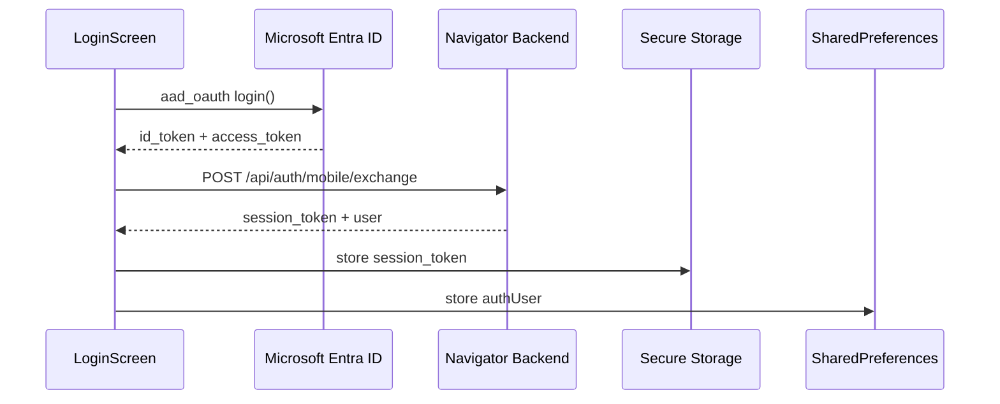

### Dashboard

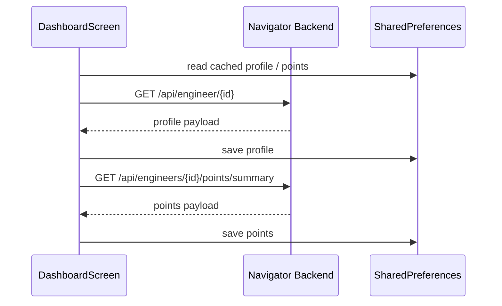

### Leaderboard

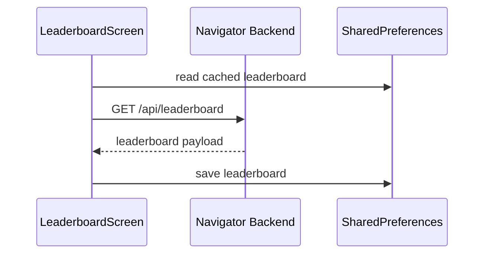

### Rewards

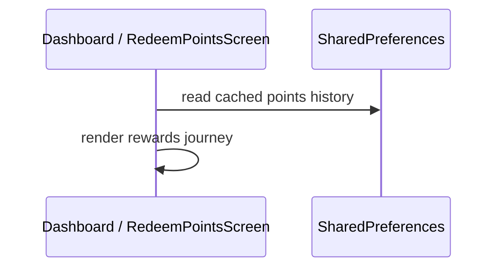

### Vehicle Check

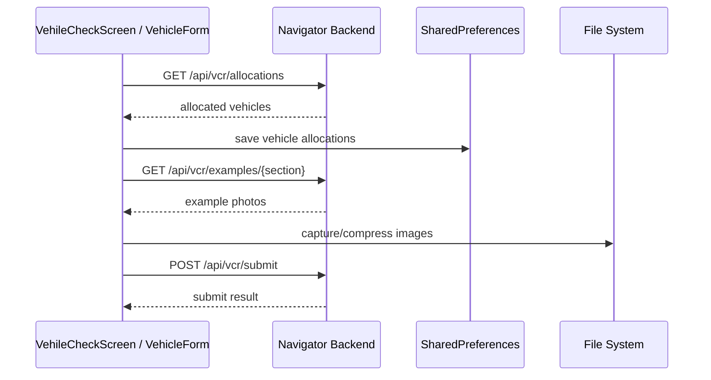

### Profile

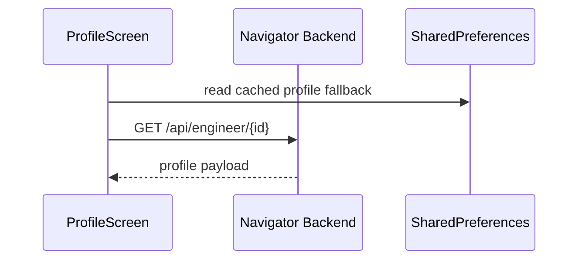

### Schedule

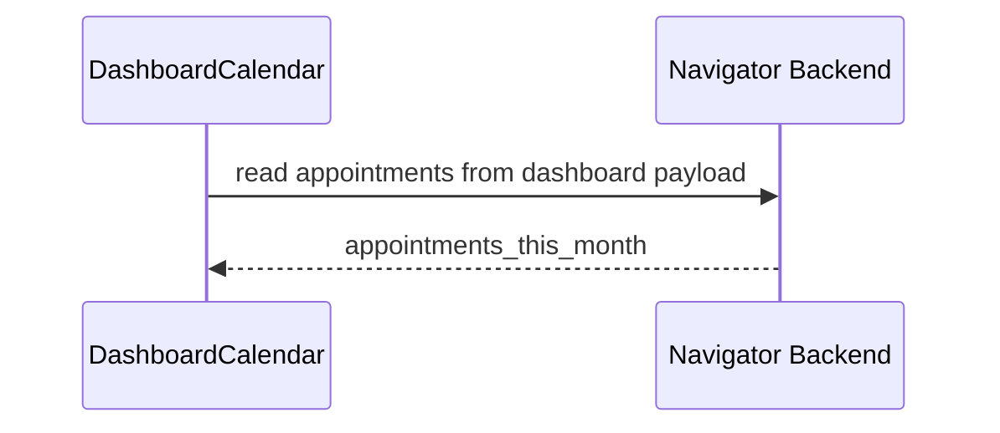

### Absence

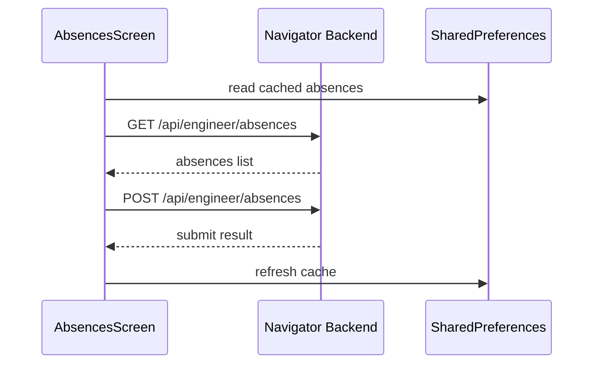

### Enquiries

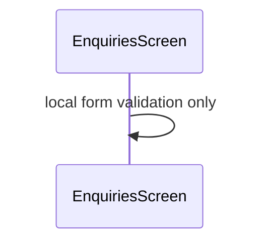

### Forms

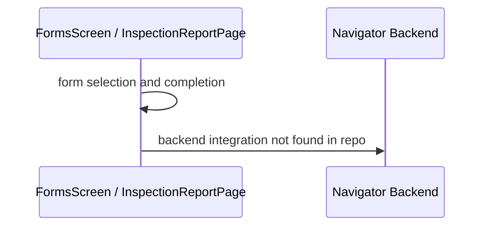

### Milestones

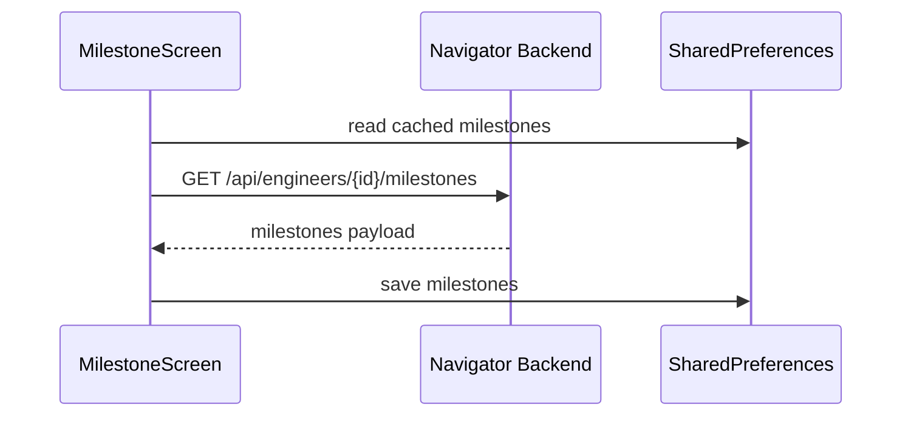

### Goals

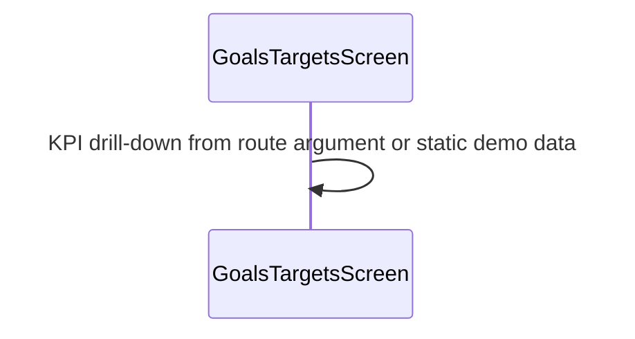

### Notifications

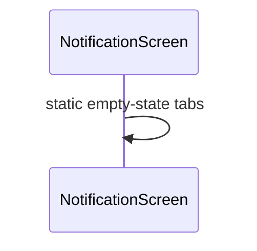

### Navigator Chat

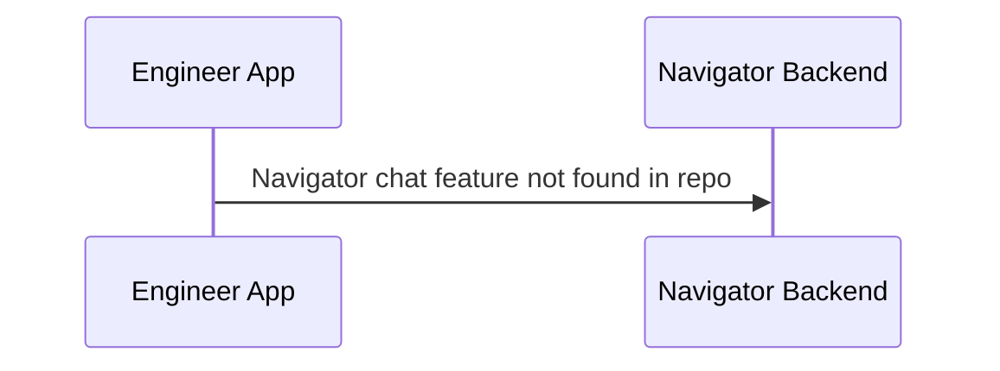

## 10 API Inventory

| Method | Endpoint | Purpose | Flutter Screen | Backend File | Navigator Module | Authentication | Salesforce Objects | Firestore Collections | Microservice | Caching |
|---|---|---|---|---|---|---|---|---|---|---|
| POST | `/api/auth/mobile/exchange` | Exchange Microsoft tokens for session token and user | `LoginScreen` | ⚠️ UNVERIFIED (`backend/blueprints/auth.py` and `backend/mobile_auth.py` are mentioned in docs) | Auth | Microsoft tokens in body; no Bearer yet | `ServiceResource`, `FSM__c` in docs | possibly session store in docs | Auth boundary node | Session token persisted in secure storage |
| POST | `/api/auth/signout` | Invalidate session | `ProfileScreen`, login repository | ⚠️ UNVERIFIED | Auth | Bearer session token | none directly | none directly | Auth boundary node | Clears local auth state |
| GET | `/api/engineer/{id}` | Fetch engineer profile | `DashboardScreen`, `ProfileScreen` | ⚠️ UNVERIFIED | Engineer profile | Bearer session token | none directly | none directly | Profile boundary node | Cached in SharedPreferences |
| GET | `/api/engineers/{id}/points/summary` | Fetch point history | `DashboardScreen`, `RedeemPointsScreen` | ⚠️ UNVERIFIED | Points / rewards | Bearer session token | none directly | none directly | Points boundary node | Cached in SharedPreferences |
| GET | `/api/vcr/allocations` | Load allocated vehicles | `VehileCheckScreen`, `VehicleForm` | ⚠️ UNVERIFIED | VCR | Bearer session token | none directly | none directly | VCR boundary node | Cached in SharedPreferences |
| GET | `/api/vcr/examples/{section}` | Load example photos | `VehicleForm` | ⚠️ UNVERIFIED | VCR examples | Bearer session token | none directly | none directly | VCR boundary node | In-memory only |
| POST | `/api/vcr/submit` | Submit VCR inspection | `VehicleForm` | ⚠️ UNVERIFIED | VCR submit | Bearer session token | none directly | none directly | VCR boundary node | none |
| GET | `/api/leaderboard` | Load leaderboard | `LeaderboardScreen` | ⚠️ UNVERIFIED | Leaderboard | Bearer session token | none directly | none directly | Leaderboard boundary node | Cached in SharedPreferences |
| GET | `/api/engineer/absences` | Load absence list | `AbsencesScreen` | ⚠️ UNVERIFIED | Absences | Bearer session token | none directly | none directly | Absences boundary node | Cached in SharedPreferences |
| POST | `/api/engineer/absences` | Submit absence | `AbsencesScreen` | ⚠️ UNVERIFIED | Absences | Bearer session token | none directly | none directly | Absences boundary node | Refreshed after submit |
| GET | `/api/work-orders/catalog/trades` | Load fixed-price trade catalog | `FixedPricePage` | ⚠️ UNVERIFIED | Work-orders catalog | Bearer session token | none directly | none directly | Work-orders boundary node | Cached in SharedPreferences |
| GET | `/api/work-orders/catalog/categories` | Load fixed-price categories | `FixedPricePage` | ⚠️ UNVERIFIED | Work-orders catalog | Bearer session token | none directly | none directly | Work-orders boundary node | Not cached |
| GET | `/api/work-orders/catalog/work-types` | Load fixed-price work types | `FixedPricePage` | ⚠️ UNVERIFIED | Work-orders catalog | Bearer session token | none directly | none directly | Work-orders boundary node | Not cached |

## 11 Firestore Inventory

No Firestore collections were verifiable from the client repository.

- No Firebase or Firestore packages in `pubspec.yaml`
- No Firestore client code in `lib/`
- Backend auth docs mention Firestore only as a possible session store, but that is not implemented here

### Unverified backend-only possibilities

- `sessions` or similar collection for mobile session tokens

Status: ⚠️ UNVERIFIED

## 12 Salesforce Inventory

No Salesforce client integration was verifiable from the app repository.

### Boundary-node objects mentioned in auth guides

- `ServiceResource`
- `FSM__c`

### Client-side status

- No Salesforce SDK or REST client found
- No direct Salesforce object mapping files found
- All Salesforce dependence is backend-mediated in the docs

Status: ⚠️ UNVERIFIED

## 13 Authentication Architecture

### Authentication

1. `LoginScreen` calls `LoginCubit.login()`
2. `LoginRepository` clears old auth, invokes `AzureAuthService.login(forceFresh: true)`, and reads Microsoft tokens
3. `LoginApiService.exchangeTokens()` posts `id_token` and `access_token` to `/api/auth/mobile/exchange`
4. Backend returns `session_token` and `user`
5. Client stores session token in secure storage and `AuthUser` in SharedPreferences

### Session

- Session token is treated as the app bearer credential
- `DioInterceptor` attaches `Authorization: Bearer <token>` to all non-exchange requests

### JWT / refresh

- The client does not implement a refresh-token flow
- On `401`, the interceptor clears local auth and triggers the unauthorized callback
- Backend docs describe the session token as a session JWT or opaque token, but the client is agnostic

### Permissions / role validation

- `LoginApiService` rejects any non-engineer user role returned from the backend
- `LoginRepository.checkAuth()` also rejects a cached auth user whose role is not `engineer`
- This is client-side gating; authoritative role validation belongs to the backend

### Cookies / secure storage

- No cookie-based auth is used in the mobile client
- Session token is stored in `flutter_secure_storage`
- Older tokens are migrated from legacy SharedPreferences keys if present

### Token lifecycle

- Microsoft tokens are transient
- Only the Navigator session token is persisted
- Logout clears both backend and local state

Evidence: [lib/screens/login/repo/login_repository.dart](/Users/gaurav/Documents/Work/aspect/chumley_navigator/lib/screens/login/repo/login_repository.dart#L19), [lib/core/network/dio_interceptors.dart](/Users/gaurav/Documents/Work/aspect/chumley_navigator/lib/core/network/dio_interceptors.dart#L18), [lib/core/storage/session_storage.dart](/Users/gaurav/Documents/Work/aspect/chumley_navigator/lib/core/storage/session_storage.dart#L1)

## 14 Internal Connections

| Flutter Screen | Repository | Service | Backend Module | Salesforce | Firestore | Response |
|---|---|---|---|---|---|---|
| LoginScreen | `LoginRepository` | `LoginApiService`, `AzureAuthService` | auth boundary node | engineer role resolution in docs | none verified | `AuthUser` + session token |
| DashboardScreen | `DashboardRepository` | `DashboardApiService` | profile / points boundary nodes | none directly | none verified | `UserModel` + `EngineerPerformanceHistory` |
| LeaderboardScreen | `LeaderboardRepository` | `LeaderboardApiService` | leaderboard boundary node | none directly | none verified | `LeaderboardResponse` |
| MilestoneScreen | `MilestonesRepository` | `MilestonesApiService` | milestones boundary node | none directly | none verified | `MilestonesResponse` |
| VehileCheckScreen | `VehicleCheckRepository` | `VehicleCheckApiService` | VCR boundary node | none directly | none verified | `VehicleResponse` |
| VehicleForm | `VcrExamplesRepository` / `VehicleCheckRepository` | `VcrExamplesApiService` / `VehicleCheckApiService` | VCR boundary node | none directly | none verified | example photos + submit result |
| AbsencesScreen | `AbsencesRepository` | `AbsencesApiService` | absences boundary node | none directly | none verified | `ListMyAbsenceResponse` |
| FixedPricePage | `FixedPriceRepository` | `FixedPriceApiService` | work-orders boundary node | none directly | none verified | trades, categories, work types |

## 15 Cross Product Dependency Matrix

| Engineer Feature | Navigator Backend Module | Backend API | Salesforce | Firestore | Microservice | AI | Cache |
|---|---|---|---|---|---|---|---|
| Login | auth boundary | `/api/auth/mobile/exchange`, `/api/auth/signout` | ServiceResource / FSM__c in docs | possible session store in docs | auth | none found | secure storage + auth user |
| Dashboard | profile / points | `/api/engineer/{id}`, `/api/engineers/{id}/points/summary` | none directly | none verified | profile / points | none found | profile + points |
| Leaderboard | leaderboard | `/api/leaderboard` | none directly | none verified | leaderboard | none found | leaderboard cache |
| Milestones | milestones | `/api/engineers/{id}/milestones` | none directly | none verified | milestones | none found | milestones cache |
| Vehicle | VCR | `/api/vcr/allocations`, `/api/vcr/examples/{section}`, `/api/vcr/submit` | none directly | none verified | VCR | none found | allocations cache + in-memory examples |
| Absences | absences | `/api/engineer/absences` | none directly | none verified | absences | none found | absences cache |
| Enquiries | none found | none found | none found | none found | none found | none found | none found |
| Forms | none found | none found | none found | none found | none found | none found | none found |
| Goals | none found | none found | none found | none found | none found | none found | none found |
| Rewards | points | `/api/engineers/{id}/points/summary` | none directly | none verified | points | none found | points cache |
| Fixed price | work-orders catalog | `/api/work-orders/catalog/*` | none directly | none verified | work-orders | none found | fixed-price trades cache |
| Notifications | none found | none found | none found | none found | none found | none found | none found |
| Profile | profile / signout | `/api/engineer/{id}`, `/api/auth/signout` | none directly | none verified | profile / auth | none found | profile cache |

## 16 Architecture Summary

```yaml
nodes:
  - Engineer App
  - Navigator Backend (Boundary Node)
  - Microsoft Entra ID (Boundary Node)
  - Salesforce (Boundary Node)
  - Firestore (Boundary Node)
  - TomTom Maps (Boundary Node)
  - Google Maps / Apple Maps (Boundary Node)
  - SharedPreferences
  - Flutter Secure Storage
  - In-memory caches
edges:
  - Engineer App -> Microsoft Entra ID: aad_oauth PKCE login
  - Engineer App -> Navigator Backend: bearer-authenticated REST API
  - Engineer App -> SharedPreferences: theme + cached domain data
  - Engineer App -> Flutter Secure Storage: session token
  - Navigator Backend -> Salesforce: engineer resolution and business data (docs only)
  - Navigator Backend -> Firestore: possible session storage (docs only)
  - Engineer App -> TomTom Maps: tile rendering
  - Engineer App -> Google Maps / Apple Maps: external navigation launch
zones:
  - client_ui
  - client_persistence
  - external_auth
  - backend_boundary
  - external_saas
realtime:
  - none verified
async:
  - all backend fetches are async
  - login exchange is async
  - photo capture and compression are async
boundary_nodes:
  - Navigator Backend
  - Microsoft Entra ID
  - Salesforce
  - Firestore
  - TomTom Maps
  - Google Maps / Apple Maps
shared_infrastructure:
  - session bearer token
  - route table
  - theme scope
  - local caches
shared_services:
  - ApiClient
  - AzureAuthService
  - Prefs
  - SessionStorage
external_services:
  - Microsoft Entra ID
  - TomTom Maps
  - Google Maps / Apple Maps
```

## 17 Risks and Technical Debt

1. Release Android builds are signed with the debug keystore.
   - Location: [android/app/build.gradle.kts](/Users/gaurav/Documents/Work/aspect/chumley_navigator/android/app/build.gradle.kts#L20)
   - Impact: release distribution is not production-safe

2. Android package name still uses `com.example.chumley_navigator`.
   - Location: [android/app/build.gradle.kts](/Users/gaurav/Documents/Work/aspect/chumley_navigator/android/app/build.gradle.kts#L9)
   - Impact: release readiness and app-registration mismatch risk

3. iOS and macOS bundle identifiers still use `com.example...`.
   - Location: [ios/Runner.xcodeproj/project.pbxproj](/Users/gaurav/Documents/Work/aspect/chumley_navigator/ios/Runner.xcodeproj/project.pbxproj#L372), [macos/Runner/Configs/AppInfo.xcconfig](/Users/gaurav/Documents/Work/aspect/chumley_navigator/macos/Runner/Configs/AppInfo.xcconfig#L11)
   - Impact: deployment and auth redirect mismatch risk

4. Token logging is not properly masked.
   - Location: [lib/core/log.dart](/Users/gaurav/Documents/Work/aspect/chumley_navigator/lib/core/log.dart#L9)
   - Impact: bearer or id tokens may be exposed in logs

5. The app has no reproducible CI/CD workflow in-repo.
   - Location: repository sweep
   - Impact: build and deployment process is not encoded as code

6. Backend ownership and microservice boundaries are not represented in the repository.
   - Location: all API boundary docs
   - Impact: architecture cannot be fully verified from the client repo alone

7. `FixedPricePage` caches trades only; categories and work types are not cached.
   - Location: [lib/screens/job_details/repo/fixed_price_repository.dart](/Users/gaurav/Documents/Work/aspect/chumley_navigator/lib/screens/job_details/repo/fixed_price_repository.dart#L14)
   - Impact: repeated network dependency for later steps

8. `Home` swaps tabs in a single widget tree rather than preserving nested navigation stacks.
   - Location: [lib/screens/home/home.dart](/Users/gaurav/Documents/Work/aspect/chumley_navigator/lib/screens/home/home.dart#L24)
   - Impact: tab state and scroll state are not preserved across tab switches

9. `JobDetailPage` depends on external maps and geocoding services without a visible offline strategy.
   - Location: [lib/screens/job_details/job_detail_page.dart](/Users/gaurav/Documents/Work/aspect/chumley_navigator/lib/screens/job_details/job_detail_page.dart#L44)
   - Impact: map and navigation features degrade under connectivity or permission loss

## 18 Unknowns

- Navigator Backend microservice names: ⚠️ UNVERIFIED
- Backend file paths and ownership: ⚠️ UNVERIFIED
- Salesforce object coverage beyond `ServiceResource` and `FSM__c`: ⚠️ UNVERIFIED
- Firestore collections: ⚠️ UNVERIFIED
- Cloud Run / Firebase / hosting usage: ⚠️ UNVERIFIED
- Regions for backend and cloud services: ⚠️ UNVERIFIED
- AI services and model selection: ⚠️ UNVERIFIED
- CI/CD ownership and deployment automation: ⚠️ UNVERIFIED
- Exact cache TTLs and invalidation policies: ⚠️ UNVERIFIED
- Navigator Chat: no implementation found in repo, therefore ⚠️ UNVERIFIED / absent

## 19 Security Review

| Severity | Location | Reason | Impact | Mitigation |
|---|---|---|---|---|
| High | [android/app/build.gradle.kts](/Users/gaurav/Documents/Work/aspect/chumley_navigator/android/app/build.gradle.kts#L20) | Release build is signed with the debug keystore | Anyone with the repo/build artifact path could ship an insecure release configuration | Configure a real release signing config and secret store |
| High | [lib/core/log.dart](/Users/gaurav/Documents/Work/aspect/chumley_navigator/lib/core/log.dart#L9) | `maskToken()` appends ellipsis to the full token instead of masking it | Session or Microsoft tokens can leak into logs | Redact tokens to a short prefix/suffix or never log them |
| Medium | [lib/core/app_constants.dart](/Users/gaurav/Documents/Work/aspect/chumley_navigator/lib/core/app_constants.dart#L2) | Production defaults are embedded in source-driven config | Misconfigured builds may point at prod and leak requests | Move env values into explicit build pipelines and validate on startup |
| Medium | [lib/service/auth_service.dart](/Users/gaurav/Documents/Work/aspect/chumley_navigator/lib/service/auth_service.dart#L21) | OAuth redirect/client settings are build-time constants but no validation exists in-app | Misconfiguration can break auth or send users to the wrong tenant | Validate presence and format before launching login |
| Low | [lib/core/storage/prefs.dart](/Users/gaurav/Documents/Work/aspect/chumley_navigator/lib/core/storage/prefs.dart#L58) | Auth user metadata is stored in SharedPreferences | Non-secret metadata remains on disk | Keep only minimal non-sensitive fields and clear aggressively on logout |

### Security conclusion

The strongest security control in the client is the secure-storage session token plus bearer auth interceptor. The biggest issues are release signing and token logging. No direct Firestore/Salesforce exposure was found in the client, which keeps the app boundary clean, but backend implementation remains a required follow-up.
